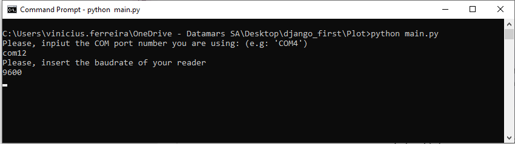
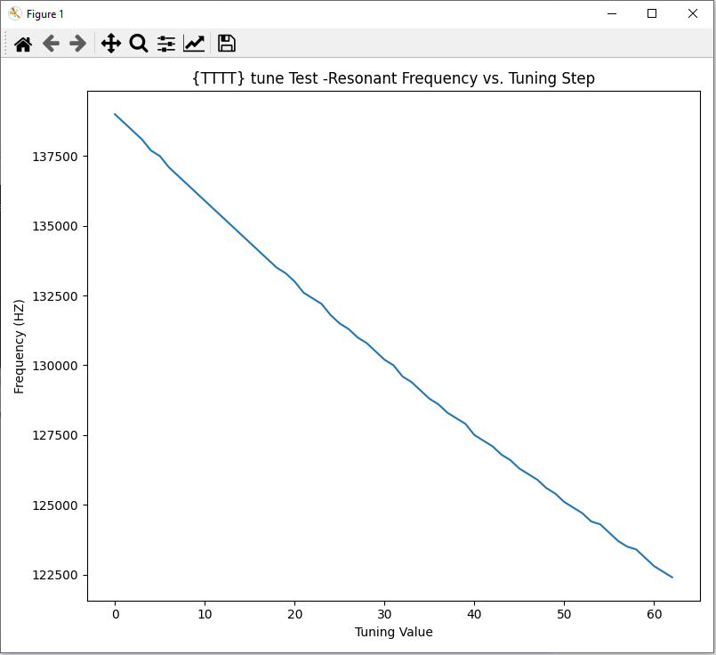

# XRS2i-SRS2i-and-XRP2i-Tuning-Script
Tuning Script to use with Tru-Test devices XRP2i and XRS2i/SRS2i. The devices must be connected via Serial on the PC.

The COM port and Baud Rate of the reader must be inserted via CMD.

And the image of the tuning curve will be plotted.
